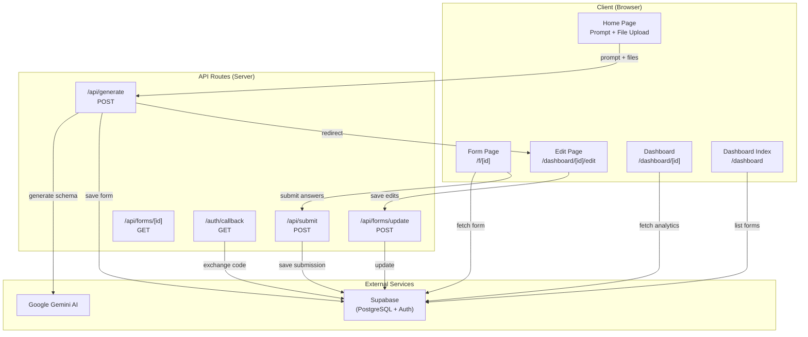
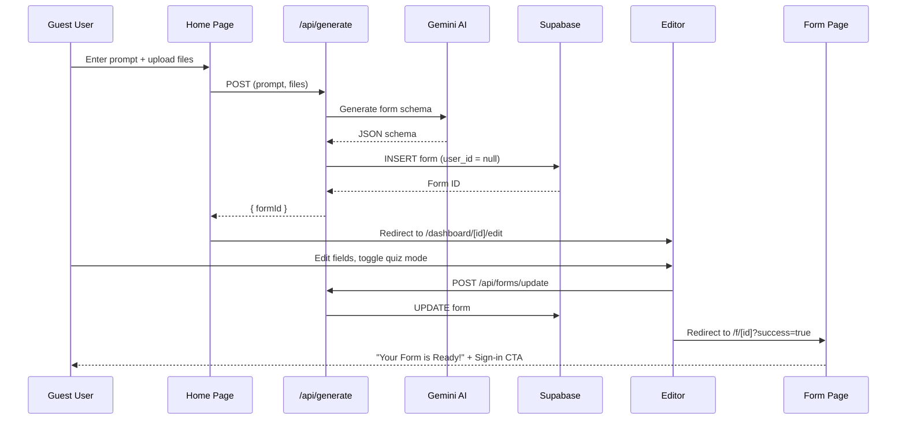
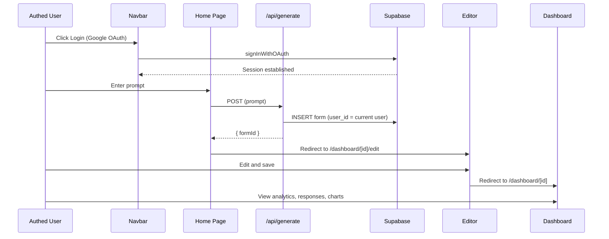
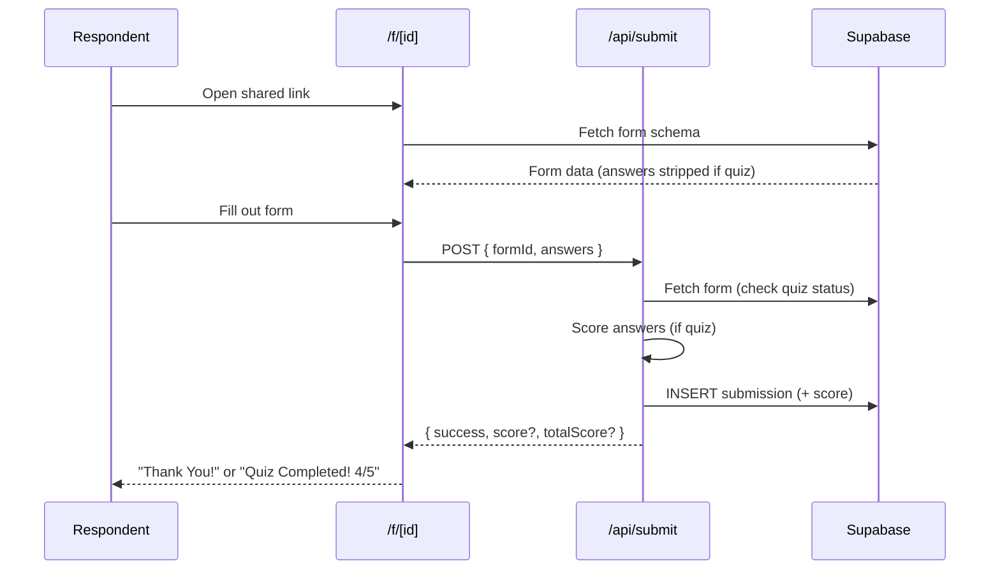
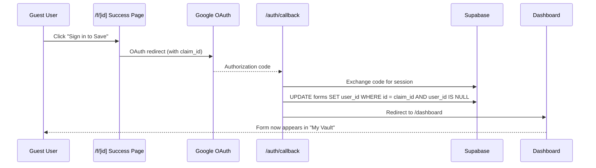

# Text2Form.ai — Product Specification Document

> **Version:** 1.0  
> **Date:** March 15, 2026  
> **Author:** Automated Analysis  
> **Project:** Text2Form

---

## 1. Executive Summary

**Text2Form.ai** is an AI-powered form and quiz builder that allows users to create professional forms and quizzes by describing their needs in natural language. It leverages **Google Gemini AI** to parse user prompts (and optionally uploaded documents) into structured form schemas, which are then rendered as interactive, shareable web forms. Responses are tracked via a real-time analytics dashboard.

> **Key Highlight:** The application supports a **dual-user model**: users can generate and share forms as **guests** (no account required) or **sign in via Email/Password or Google** to permanently manage their forms in a personal dashboard.

---

## 2. Product Vision & Goals

| Aspect | Detail |
|--------|--------|
| **Target Users** | Educators, event organizers, survey creators, small businesses — anyone needing quick, professional forms |
| **Core Value** | Eliminate manual drag-and-drop form building; describe what you need, AI builds it instantly |
| **Differentiator** | AI-first approach with document-based context parsing (PDF, DOCX, TXT, images) |
| **Hackathon Context** | Built for the **TestSprite Hackathon**, optimized for Innovation, Project Quality, and Test Quality |

---

## 3. Tech Stack

| Layer | Technology | Details |
|-------|------------|---------|
| **Framework** | Next.js 16 (App Router) | React 19, TypeScript 5 |
| **Styling** | Tailwind CSS v4 + Shadcn UI v4 | Retro pixel-art design system |
| **AI Model** | Google Gemini 3.1 Flash Lite Preview | Via `@google/genai` SDK |
| **Database** | Supabase (PostgreSQL) | Row Level Security, real-time queries |
| **Auth** | Supabase Auth (Google OAuth) | SSR-compatible via `@supabase/ssr` |
| **Charts** | Recharts v3 | Bar charts for response distribution |
| **File Parsing** | `unpdf` (PDF), `mammoth` (DOCX) | Text extraction for AI context |
| **Font** | Geist (sans-serif) + VT323 (pixel) | Dual typography system |
| **Notifications** | Sonner | Toast notification system |
| **Drag & Drop** | react-dropzone | File upload component |

### Dependencies (Full List)

| Package | Version | Purpose |
|---------|---------|---------|
| `next` | 16.1.6 | Core framework |
| `react` / `react-dom` | 19.2.3 | UI library |
| `@google/genai` | ^1.45.0 | Gemini AI client |
| `@supabase/ssr` | ^0.9.0 | SSR-compatible Supabase |
| `@supabase/supabase-js` | ^2.99.1 | Supabase client SDK |
| `mammoth` | ^1.12.0 | DOCX text extraction |
| `unpdf` | ^1.4.0 | PDF text extraction |
| `recharts` | ^3.8.0 | Data visualization charts |
| `react-dropzone` | ^15.0.0 | Drag-and-drop file upload |
| `sonner` | ^2.0.7 | Toast notifications |
| `lucide-react` | ^0.577.0 | Icons |
| `shadcn` | ^4.0.6 | UI component library |
| `next-themes` | ^0.4.6 | Dark/light mode theming |
| `@theme-toggles/react` | ^4.1.0 | Theme toggle controls |
| `class-variance-authority` | ^0.7.1 | Component variant management |
| `clsx` | ^2.1.1 | Conditional CSS class names |
| `tailwind-merge` | ^3.5.0 | Tailwind class merging |
| `tw-animate-css` | ^1.4.0 | Tailwind animation utilities |
| `@fontsource/vt323` | ^5.2.7 | Pixel font |
| `@base-ui/react` | ^1.3.0 | Base UI primitives |

---

## 4. Architecture Overview



---

## 5. Database Schema

### 5.1 `forms` Table

| Column | Type | Default | Description |
|--------|------|---------|-------------|
| `id` | `uuid` (PK) | `uuid_generate_v4()` | Unique form ID |
| `title` | `text` | `'Untitled Form'` | Form title |
| `description` | `text` | `''` | Brief description |
| `schema` | `jsonb` | `'[]'` | Array of `FormField` objects |
| `user_id` | `uuid` (FK → auth.users) | `null` | Owner (null = guest/unclaimed) |
| `is_quiz` | `boolean` | `false` | Whether this is a quiz with correct answers |
| `created_at` | `timestamptz` | `now()` | Creation timestamp |

### 5.2 `submissions` Table

| Column | Type | Default | Description |
|--------|------|---------|-------------|
| `id` | `uuid` (PK) | `uuid_generate_v4()` | Unique submission ID |
| `form_id` | `uuid` (FK → forms.id, CASCADE) | — | Parent form |
| `answers` | `jsonb` | `'{}'` | Map of `field_id → answer` |
| `score` | `integer` | `null` | Auto-graded quiz score |
| `submitted_at` | `timestamptz` | `now()` | Submission timestamp |

### 5.3 Row Level Security (RLS) Policies

The database uses **6 incremental migrations** with the following security model:

| Policy | Table | Effect |
|--------|-------|--------|
| Anyone can view forms | `forms` | `SELECT` — public |
| Anyone can create forms | `forms` | `INSERT` — public |
| Owners can update their forms | `forms` | `UPDATE` — `user_id = auth.uid()` |
| Allow claiming guest forms | `forms` | `UPDATE` — `user_id IS NULL` (claim for self) |
| Anyone can view submissions | `submissions` | `SELECT` — public |
| Anyone can create submissions | `submissions` | `INSERT` — public |

### 5.4 Migration History

| Migration | Purpose |
|-----------|---------|
| `0001_initial_schema.sql` | Base `forms` and `submissions` tables, initial RLS policies |
| `0002_add_auth.sql` | Authentication integration |
| `0003_allow_claiming_forms.sql` | Guest form claiming via OAuth |
| `0004_tighten_submission_security.sql` | Refined submission access policies |
| `0005_add_quiz_and_score.sql` | `is_quiz` column on forms, `score` column on submissions |
| `0006_fix_forms_update_policy.sql` | Corrected form update RLS policy |

---

## 6. TypeScript Data Models

Defined in `src/lib/types.ts`:

```typescript
interface FormField {
  id: string;
  type: "text" | "textarea" | "radio" | "checkbox" | "select";
  label: string;
  placeholder?: string;
  required?: boolean;
  options?: string[];         // Only for radio/checkbox/select
  correctAnswer?: string | string[];  // Only for quiz mode
}

interface FormSchema {        // AI response structure
  title: string;
  description: string;
  fields: FormField[];
  is_quiz?: boolean;
}

interface FormRecord {        // Database row
  id: string;
  title: string;
  description: string;
  schema: FormField[];
  is_quiz: boolean;
  user_id?: string | null;
  created_at: string;
}

interface SubmissionRecord {  // Database row
  id: string;
  form_id: string;
  answers: Record<string, string | string[]>;
  score?: number | null;
  submitted_at: string;
}
```

---

## 7. Complete Feature Specifications

### 7.1 Feature: AI-Powered Form Generation

**Entry Point:** Home Page (`/`) → API (`/api/generate`)

| Aspect | Detail |
|--------|--------|
| **Input** | Natural language prompt (text) and/or uploaded files |
| **Accepted Files** | PDF (`.pdf`), Word (`.docx`), Plain Text (`.txt`), Images (`.png`, `.jpg`, `.jpeg`) |
| **Max Files** | 3 files simultaneously |
| **AI Model** | `gemini-3.1-flash-lite-preview` |
| **Response Format** | Structured JSON (`application/json` response MIME type) |
| **Output** | Redirects to `/dashboard/[id]/edit` with the generated form |
| **Dual Input Paths** | JSON body (no files) OR multipart/form-data (with files) |
| **Vision Support** | Images are sent as inline base64 to Gemini's vision capability |

**Processing Pipeline:**

1. Accept prompt via JSON body OR multipart/form-data (when files are attached)
2. Extract text from documents:
   - **PDF** → `unpdf.extractText()` with `mergePages: true`
   - **DOCX** → `mammoth.extractRawText()`
   - **TXT** → Direct UTF-8 decode
   - **Images** → Sent as inline base64 to Gemini Vision
3. Construct multi-part prompt: System prompt + document context + user instructions
4. Call Gemini AI with structured JSON response mode
5. Parse + validate the JSON schema (must have `fields` array)
6. Insert form into Supabase `forms` table (with `user_id` if authenticated, `null` if guest)
7. Return `{ formId, title, fieldsCount }`

**AI System Prompt Rules:**
- Generate 3–10 fields based on complexity of the request
- Use appropriate field types (text for short answers, textarea for long answers, radio for single choice, checkbox for multiple choice, select for dropdowns)
- `options` is ONLY required for radio, checkbox, and select types
- Each field MUST have a unique `id` (snake_case like `field_1`, `field_2`)
- Make labels clear and professional
- Always return valid JSON only, no markdown, no code fences

**UI Elements (Home Page):**
- `data-testid="prompt-input"` — Textarea for entering prompt
- `data-testid="generate-button"` — Submit button with loading spinner
- `data-testid="generation-error"` — Error display box
- Dynamic placeholder text changes based on whether files are attached
- File count indicator showing "N files attached" or "AI-generated instantly"

---

### 7.2 Feature: Form Editor

**Route:** `/dashboard/[id]/edit`

| Feature | Description |
|---------|-------------|
| **Edit Title** | Inline text input for form title |
| **Edit Description** | Inline textarea for form description |
| **Edit Question Label** | Per-field input to modify question text |
| **Edit Question Placeholder** | Per-field optional placeholder text |
| **Change Question Type** | Dropdown selector with: Text Input, Paragraph, Multiple Choice, Checkboxes, Dropdown |
| **Toggle Required** | Checkbox to mark field as required |
| **Reorder Questions** | Move up/down buttons (appear on hover over field card) |
| **Delete Questions** | X button to remove individual fields (appears on hover) |
| **Add Questions** | "+ Add New Question" large button at bottom |
| **Options Management** | Add/remove individual options for radio/checkbox/select fields |
| **Quiz Mode Toggle** | Retro-styled toggle button to enable quiz grading |
| **Correct Answer Config (Radio/Select)** | Dropdown selector to pick single correct answer |
| **Correct Answer Config (Checkbox)** | Multi-select checkboxes to pick multiple correct answers |
| **Save Form** | "Save Form" button with loading state ("Saving...") |
| **Navigation** | "← Back to Dashboard" (for owners) or "← Back to Home" (for guests) |

**Save Behavior:**
- Guest users (form has no `user_id`) → redirects to `/f/[id]?success=true` (public form page with success message)
- Authenticated owners → redirects to `/dashboard/[id]` (analytics dashboard)

**Authorization Logic:**
1. If form has no owner (`user_id = null`) → allow editing (guest flow)
2. If form has an owner → current user must match `user_id`
3. Unauthorized access → toast error "Access denied" + redirect to `/dashboard`
4. Form not found → toast error "Form not found" + redirect to `/`

---

### 7.3 Feature: Dynamic Form Rendering (DynamicForm Component)

**Component:** `src/components/DynamicForm.tsx`

This is the core rendering engine that maps JSON form schemas into interactive UI components.

| Field Type | UI Component | User Interaction |
|------------|-------------|-----------------|
| `text` | `<Input>` | Single-line text input |
| `textarea` | `<Textarea>` | Multi-line paragraph input (4 rows, min 120px height) |
| `radio` | `<RadioGroup>` with custom styled items | Click to select one option (card-style selection with highlight) |
| `checkbox` | Custom `<Checkbox>` group | Click to toggle multiple options (card-style with checkmark) |
| `select` | `<Select>` dropdown | Click to open dropdown, select one option |

**Key Behaviors:**
- State managed via `useState` as `Record<string, string | string[]>`
- Fields animate in with staggered `fade-in slide-in-from-bottom-4` (80ms delay per field)
- Required fields show a red asterisk (`*`) next to the label
- Radio/checkbox options use card-style UI with background color changes on selection
- Submit button shows spinning loader during submission
- Error messages displayed in a destructive-styled banner
- `data-testid` attributes on every interactive element for test automation

---

### 7.4 Feature: Public Form Page (Fill & Submit)

**Route:** `/f/[id]`

| Feature | Description |
|---------|-------------|
| **Form Title Display** | Large pixel-font heading with `data-testid="form-title"` |
| **Form Description** | Subtitle text with description |
| **Question Count Badge** | Shows "N Questions" in a badge |
| **Creation Date** | Formatted date (e.g., "Mar 15, 2026") |
| **Share Link Button** | Copies current URL to clipboard with "Copied!" feedback |
| **Back Navigation** | "← Back" link to home page |
| **Dynamic Form** | Full `DynamicForm` component rendering all fields |
| **Submission** | POST to `/api/submit` with `{ formId, answers }` |
| **Quiz Score Display** | After quiz submission: shows score (e.g., "4 / 5") in large display |
| **Thank You State** | After regular form submission: "Thank You! Your response has been recorded." |
| **Guest Creation Success** | If `?success=true` param: shows "Your Form is Ready!" with sharing options |
| **Email Sign-In CTA** | For guest forms: "Continue with Email" button redirects to `/login` with `claim_id` |
| **Google Sign-In CTA** | For guest forms: "Continue with Google" button triggers OAuth with `claim_id` |
| **Live Results Link** | Button linking to `/dashboard/[id]` |
| **Create Another Link** | Button linking back to `/` |
| **Loading State** | Skeleton placeholders while form data loads |
| **Error State** | Styled error with "Back to Home" link when form not found |

---

### 7.5 Feature: Analytics Dashboard

**Route:** `/dashboard/[id]`

| Feature | Description |
|---------|-------------|
| **Form Title & Description** | Header section with form metadata |
| **Edit Form Button** | Link to `/dashboard/[id]/edit` |
| **Share Form Button** | `data-testid="copy-link-button"` — Copies shareable link with "Copied!" feedback |
| **View Live Button** | `data-testid="view-form-link"` — Opens public form in new tab |
| **Total Responses Card** | `data-testid="stat-total-responses"` — Primary-colored stat card showing submission count |
| **Questions Card** | `data-testid="stat-total-fields"` — Secondary-colored stat card showing field count |
| **Components Card (Forms)** | `data-testid="stat-completion-rate"` — Accent-colored card showing unique field types as badges |
| **Average Score Card (Quizzes)** | Destructive-colored card showing average score across all submissions |
| **Response Distribution Chart** | `AnalyticsChart` component — Recharts bar chart for first radio/select/checkbox field |
| **Submissions Table** | `SubmissionsTable` component — Full data table with all responses |
| **Loading State** | Full-page skeleton with retro-styled placeholders |
| **Access Denied State** | Styled lock icon with "Only the creator of this form can view its dashboard" |
| **Form Not Found State** | Styled error with "Go Home" button |

**Chart Data Logic:**
- Scans the form schema for the **first** field with type `radio`, `select`, or `checkbox`
- Counts the frequency of each option across all submissions
- Renders as colored bars using a purple palette (`#8b5cf6`, `#a78bfa`, `#c4b5fd`, etc.)
- Shows "No data available yet" when no chartable data exists

**Submissions Table Features:**
- Row number column (#)
- Score column (if quiz mode) — shows score with `/total` suffix
- One column per form field (shows answers, with badges for array answers)
- Timestamp column with formatted date
- Empty state: "No submissions yet" with CTA to share the form link

---

### 7.6 Feature: Dashboard Index (My Forms / My Vault)

**Route:** `/dashboard`

| Feature | Description |
|---------|-------------|
| **Server-Side Auth Check** | Unauthenticated users redirected to `/` |
| **Page Title** | "My Vault" in large pixel font |
| **Managed Assets Count** | Shows total number of forms |
| **New Form Button** | "+ New Form" — links to home page |
| **Form Cards Grid** | 1-3 column responsive grid |
| **Form Type Badge** | "QUIZ_MODE" (secondary color) or "FORM_DATA" (accent color) |
| **Form Title** | Large text, 1-line clamp |
| **Form Description** | 2-line clamp with hover color transition |
| **Response Count** | Per-form submission count with user icon |
| **Creation Date Identity** | Calendar icon with formatted date |
| **View Analytics Action** | Bar chart icon button → `/dashboard/[id]` |
| **Edit Form Action** | Pencil icon button → `/dashboard/[id]/edit` |
| **Delete Form Action** | Trash icon button → Calls `/api/forms/delete` with confirmation |
| **View Public Link Action** | External link icon button → `/f/[id]` (opens in new tab) |
| **Empty State** | "Database Empty" with document icon, "No forms detected in your neural network" message, "Initialize Sequence" CTA |
| **Card Hover Effects** | Shadow offset animations, translate transforms on hover |

---

### 7.7 Feature: Authentication System

| Component | Implementation |
|-----------|----------------|
| **Providers** | Email/Password and Google OAuth via Supabase Auth |
| **Login Route** | Centralized `/login` page with Sign In / Sign Up toggles |
| **Login Trigger** | Navbar "LOGIN" button redirects to `/login` |
| **Login Flow (Email)** | `signInWithPassword` or `signUp` → redirect to dashboard |
| **Login Flow (Google)** | `signInWithOAuth({ provider: "google" })` from `/login` or form page |
| **OAuth Callback** | `/auth/callback` — exchanges code for session; handles Google redirects |
| **Form Claiming** | Both flows accept `claim_id` → updates `forms.user_id` from `null` to authenticated user |
| **Sign Out (Client)** | Navbar sign-out button → `supabase.auth.signOut()` → redirect to `/` |
| **Sign Out (Server)** | `/auth/signout` POST route → server-side sign out → redirect |
| **Session Management** | Server: `createServerClient()` with cookie-based sessions; Client: `createBrowserClient()` |
| **Auth State Listener** | Navbar subscribes to `onAuthStateChange` for real-time updates |
| **Error Handling** | Failed auth callback redirects to `/?error=auth-callback-failed` |

**Navbar States:**

| State | Elements Displayed |
|-------|-------------------|
| **Logged Out** | Google Login button (`data-testid="login-btn"`) with Google logo SVG |
| **Logged In** | "My Forms" button (`data-testid="my-forms-btn"`), user avatar (Google photo or fallback icon), user name/email, red sign-out button |

---

### 7.8 Feature: File Upload System

**Component:** `src/components/FileUploader.tsx`

| Feature | Detail |
|---------|--------|
| **Library** | `react-dropzone` |
| **Max Files** | 3 (configurable via `maxFiles` prop) |
| **Accepted Types** | PDF (`.pdf`), DOCX (`.docx`), TXT (`.txt`), PNG (`.png`), JPEG (`.jpg`, `.jpeg`) |
| **Drag & Drop** | Full visual feedback — border color changes, background highlight on drag |
| **File Preview** | Color-coded type badges: PDF (rose), DOCX (blue), TXT (emerald), IMG (fuchsia) |
| **File Size Display** | Formatted as B / KB / MB |
| **Remove File** | Destructive-colored X button on each file card |
| **Grid Layout** | 3-column grid on desktop; drop zone fills remaining columns |
| **Disabled State** | Drop zone hidden once max files reached |
| **Unique IDs** | Each file gets a unique ID based on `name + timestamp + random` |

---

### 7.9 Feature: Interactive Background Grid

**Component:** `src/components/InteractiveGrid.tsx`

| Feature | Detail |
|---------|--------|
| **Rendering** | Fixed full-viewport grid of 64×64px cells |
| **Color Assignment** | Each cell randomly gets `bg-primary`, `bg-secondary`, or `bg-accent` |
| **Animation** | `autonomous-pulse` keyframe: fade from 0 → 15% opacity → 0 |
| **Cycle Duration** | 4–8 seconds per pulse (random per cell) |
| **Animation Delay** | 0–5 seconds random offset (prevents synchronized pulsing) |
| **Responsiveness** | Recalculates grid on window resize |
| **Performance** | `React.memo` on individual cells to prevent re-renders; `useMemo` for config |
| **Layering** | `z-[-1]`, `pointer-events-none`, `fixed inset-0` — behind all content |
| **Global Presence** | Rendered in root layout — visible on every page |

---

### 7.10 Feature: Toast Notification System

**Component:** Sonner `Toaster` (placed in root layout)

| Context | Message |
|---------|---------|
| Form save success | "Form saved successfully" |
| Form not found (editor) | "Form not found" |
| Access denied (editor) | "Access denied: You do not own this form" |
| Save error | Dynamic error message |

---

### 7.11 Feature: Clipboard Sharing

Available on two pages:

| Page | Button | Behavior |
|------|--------|----------|
| Dashboard (`/dashboard/[id]`) | "Share form" button | Copies `{origin}/f/{formId}` to clipboard |
| Public Form (`/f/[id]`) | "Share Link" button | Copies current URL to clipboard |

Both show "Copied!" text feedback for 2 seconds.

---

### 7.12 Feature: SEO & Metadata

Defined in `src/app/layout.tsx`:

| Tag | Value |
|-----|-------|
| `<title>` | "Text2Form.ai — AI-Powered Form & Quiz Builder" |
| `<meta description>` | "Create professional forms and quizzes in seconds using AI. Describe what you need in plain English, share with anyone, and track responses with live analytics." |
| `<meta keywords>` | "AI form builder", "quiz generator", "AI quiz", "form creator", "survey builder" |
| OpenGraph `title` | "Text2Form.ai — AI-Powered Form & Quiz Builder" |
| OpenGraph `type` | "website" |
| Favicon | `/favicon.svg` |

---

## 8. Page & Route Map

### 8.1 Frontend Pages

| Route | Type | Auth Required | Description |
|-------|------|---------------|-------------|
| `/` | Client Component | None | Home page — hero + prompt input + file upload |
| `/f/[id]` | Client Component | None | Public form renderer + submission |
| `/dashboard` | Server Component | **Required** (redirect if not) | User's form list ("My Vault") |
| `/dashboard/[id]` | Client Component | **Owner only** | Analytics dashboard for a form |
| `/dashboard/[id]/edit` | Client Component | Owner or Guest | Form editor |

### 8.2 API Routes

| Route | Method | Auth | Description |
|-------|--------|------|-------------|
| `/api/generate` | POST | None | AI form generation |
| `/api/submit` | POST | None | Form submission + quiz scoring |
| `/api/forms/update` | POST | Owner or Guest | Update form data |
| `/api/forms/[id]` | GET | None (strips quiz answers) | Fetch form data |
| `/auth/callback` | GET | — | OAuth callback + form claiming |
| `/auth/signout` | POST | — | Sign out |

---

## 9. Design System

### 9.1 Visual Identity

| Element | Value |
|---------|-------|
| **Aesthetic** | Retro pixel-art / neo-brutalist with modern touches |
| **Border Style** | 4px solid, stark black (light) / white (dark) |
| **Border Radius** | `0rem` globally — fully blocky, no rounded corners |
| **Shadow System** | Retro offset shadows (4px/8px/12px) with hover-press micro-animations |
| **Typography** | **VT323** (pixel font) for headings/labels/buttons, **Geist** for body text |
| **Color Palette** | Yellow (primary), Blue (secondary), Green (accent), Red (destructive) |
| **Animation** | Staggered fade-in, pulse backgrounds, bounce on success icons |
| **Selection** | Custom selection colors: primary background, primary-foreground text |

### 9.2 Custom CSS Utilities

Defined in `src/app/globals.css`:

| Utility | CSS Effect |
|---------|------------|
| `shadow-retro` | `box-shadow: 4px 4px 0px var(--border)` |
| `shadow-retro-hover` | `box-shadow: 2px 2px 0px var(--border); transform: translate(2px, 2px)` |
| `shadow-retro-active` | `box-shadow: 0px 0px 0px var(--border); transform: translate(4px, 4px)` |
| `animate-grid-pulse` | Keyframe: `0%,100% opacity 0 → 50% opacity 0.15` with custom duration/delay |

### 9.3 Color Tokens

| Token | Light Mode | Dark Mode |
|-------|-----------|-----------|
| `--background` | `oklch(0.98 0.05 100)` — Soft yellow/cream | `oklch(0.15 0.05 280)` — Deep purple/blue |
| `--foreground` | `oklch(0.15 0 0)` — Near black | `oklch(0.98 0 0)` — Near white |
| `--card` | `oklch(1 0 0)` — White | `oklch(0.2 0 0)` — Dark gray |
| `--primary` | `oklch(0.85 0.15 95)` — Vibrant Yellow | Same |
| `--secondary` | `oklch(0.65 0.2 250)` — Bright Blue | Same |
| `--accent` | `oklch(0.7 0.15 150)` — Bright Green | Same |
| `--destructive` | `oklch(0.6 0.25 25)` — Red | Same |
| `--border` | `oklch(0.15 0 0)` — Stark black | `oklch(0.98 0 0)` — White |
| `--muted` | `oklch(0.95 0 0)` | `oklch(0.25 0 0)` |
| `--muted-foreground` | `oklch(0.55 0 0)` | `oklch(0.7 0 0)` |
| `--radius` | `0rem` | `0rem` |

### 9.4 Font System

| Variable | Font | Usage |
|----------|------|-------|
| `--font-sans` | Geist | Body text, descriptions, form input text |
| `--font-pixel` | VT323 | Headings, labels, buttons, badges, stats |

---

## 10. Component Inventory

### 10.1 Custom Application Components

| Component | File | Purpose | Key Props |
|-----------|------|---------|-----------|
| `Navbar` | `src/components/Navbar.tsx` | Sticky header with logo, auth controls | — |
| `DynamicForm` | `src/components/DynamicForm.tsx` | Renders form fields from JSON schema | `fields`, `formId`, `onSubmitSuccess` |
| `AnalyticsChart` | `src/components/AnalyticsChart.tsx` | Recharts bar chart for response distribution | `data`, `title` |
| `SubmissionsTable` | `src/components/SubmissionsTable.tsx` | Table of all form submissions | `submissions`, `fields`, `isQuiz` |
| `FileUploader` | `src/components/FileUploader.tsx` | Drag-and-drop file upload with preview | `onFilesChange`, `maxFiles` |
| `InteractiveGrid` | `src/components/InteractiveGrid.tsx` | Animated background grid | — |

### 10.2 Shadcn UI Components (13 total)

| Component | File | Usage |
|-----------|------|-------|
| `Button` | `ui/button.tsx` | CTAs, submit, navigation actions |
| `Card` / `CardContent` / `CardHeader` / `CardTitle` | `ui/card.tsx` | Dashboard stat cards, form containers |
| `Input` | `ui/input.tsx` | Text input fields |
| `Textarea` | `ui/textarea.tsx` | Long-form text fields |
| `Label` | `ui/label.tsx` | Form field labels |
| `Checkbox` | `ui/checkbox.tsx` | Multi-select options, quiz correct answers |
| `RadioGroup` / `RadioGroupItem` | `ui/radio-group.tsx` | Single-select options |
| `Select` / `SelectTrigger` / `SelectContent` / `SelectItem` / `SelectValue` | `ui/select.tsx` | Dropdown selectors |
| `Table` / `TableHeader` / `TableBody` / `TableRow` / `TableHead` / `TableCell` | `ui/table.tsx` | Submissions data table |
| `Badge` | `ui/badge.tsx` | Field type tags, submission answer badges |
| `Separator` | `ui/separator.tsx` | Visual dividers |
| `Skeleton` | `ui/skeleton.tsx` | Loading state placeholders |
| `Sonner (Toaster)` | `ui/sonner.tsx` | Toast notification container |

---

## 11. API Specifications

### 11.1 `POST /api/generate`

**Purpose:** Generate a form/quiz using AI

**Request (JSON path — no files):**
```json
{
  "prompt": "Create a 5-question math quiz for grade 8"
}
```

**Request (FormData path — with files):**
```
Content-Type: multipart/form-data
prompt: "Create a quiz from this syllabus"
files: [File, File, ...]
```

**Response (200 OK):**
```json
{
  "formId": "550e8400-e29b-41d4-a716-446655440000",
  "title": "Grade 8 Math Quiz",
  "fieldsCount": 5
}
```

**Error Responses:**

| Status | Body | Condition |
|--------|------|-----------|
| 400 | `{ "error": "Please provide a prompt or upload a file for context." }` | No prompt and no files |
| 500 | `{ "error": "AI returned invalid format. Please try again." }` | Gemini returns non-JSON |
| 500 | `{ "error": "AI generated invalid form schema. Please try again." }` | Missing `fields` array |
| 500 | `{ "error": "Failed to save form. Check Supabase connection." }` | DB insert failure |
| 500 | `{ "error": "<error message>" }` | Any unexpected error |

---

### 11.2 `POST /api/submit`

**Purpose:** Submit answers to a form, with optional quiz scoring

**Request:**
```json
{
  "formId": "550e8400-e29b-41d4-a716-446655440000",
  "answers": {
    "field_1": "My text answer",
    "field_2": "Option B",
    "field_3": ["Option A", "Option C"]
  }
}
```

**Response (200 OK):**
```json
{
  "success": true,
  "is_quiz": true,
  "score": 4,
  "totalScore": 5
}
```

**Error Responses:**

| Status | Body | Condition |
|--------|------|-----------|
| 400 | `{ "error": "Missing formId or answers" }` | Missing required fields |
| 404 | `{ "error": "Form not found" }` | Invalid form ID |
| 500 | `{ "error": "Failed to submit. Please try again." }` | DB insert failure |

**Quiz Scoring Logic:**
- Compares each submitted answer against `correctAnswer` in the schema
- String fields (radio/select): exact string match
- Array fields (checkbox): all correct options must be present, and no extras
- If `score` column doesn't exist in DB: retries insert without score (backward compatibility)

---

### 11.3 `POST /api/forms/update`

**Purpose:** Update a form's title, description, schema, and quiz status

**Request:**
```json
{
  "formId": "550e8400-e29b-41d4-a716-446655440000",
  "title": "Updated Title",
  "description": "Updated description",
  "schema": [
    {
      "id": "field_1",
      "type": "text",
      "label": "What is your name?",
      "required": true
    }
  ],
  "is_quiz": false
}
```

**Response (200 OK):** `{ "success": true }`

**Error Responses:**

| Status | Body | Condition |
|--------|------|-----------|
| 400 | `{ "error": "Missing required fields" }` | Missing `formId` or `schema` |
| 403 | `{ "error": "Unauthorized: You do not own this form" }` | Not the form owner |
| 404 | `{ "error": "Form not found" }` | Invalid form ID |
| 500 | `{ "error": "Failed to update the form" }` | DB update failure |

**Authorization Rules:**
1. If form has `user_id = null` → anyone can edit (guest flow)
2. If form has `user_id` set → only that user can update

---

### 11.4 `GET /api/forms/[id]`

**Purpose:** Fetch form data with security-aware schema

**Response (200 OK):**
```json
{
  "id": "550e8400-e29b-41d4-a716-446655440000",
  "title": "My Quiz",
  "description": "A fun quiz",
  "schema": [
    {
      "id": "field_1",
      "type": "radio",
      "label": "What is 2+2?",
      "options": ["3", "4", "5"],
      "required": true
    }
  ],
  "is_quiz": true,
  "isOwner": false,
  "user_id": "user-uuid",
  "created_at": "2026-03-15T12:00:00Z"
}
```

**Security:** For quiz forms, the `correctAnswer` property is automatically **stripped** from the schema when the requester is not the form owner. This prevents answer leakage to respondents.

---

### 11.5 `POST /api/forms/delete`

**Purpose:** Delete a form owned by the authenticated user

**Request:**
```json
{
  "formId": "550e8400-e29b-41d4-a716-446655440000"
}
```

**Response (200 OK):** `{ "success": true }`

**Error Responses:**

| Status | Body | Condition |
|--------|------|-----------|
| 400 | `{ "error": "Missing formId" }` | Missing `formId` |
| 401 | `{ "error": "Unauthorized" }` | User not logged in |
| 500 | `{ "error": "Failed to delete the form" }` | DB deletion failure |

---

## 12. User Flows

### 12.1 Guest Form Creation Flow



### 12.2 Authenticated User Flow



### 12.3 Form Submission Flow



### 12.4 Form Claiming Flow (Guest → Authenticated)



---

## 13. Security Model

| Concern | Implementation |
|---------|----------------|
| **Quiz Answer Protection** | `correctAnswer` stripped from GET `/api/forms/[id]` responses for non-owners |
| **Form Ownership** | `user_id` column + RLS policies enforce owner-only updates |
| **Guest Editing** | Forms with `user_id = null` allow unrestricted editing |
| **Form Claiming** | OAuth callback can set `user_id` on unclaimed forms only (RLS: `user_id IS NULL`) |
| **Supabase RLS** | Server-side row-level security on both `forms` and `submissions` tables |
| **Dashboard Access** | Server-side redirect for unauthenticated users on `/dashboard` |
| **Client-Side Access Check** | Dashboard pages verify `user_id` matches current authenticated user |
| **CORS/CSRF** | Next.js built-in protections for API routes |
| **Server-Only Secrets** | `GEMINI_API_KEY` not prefixed with `NEXT_PUBLIC_`, only available server-side |
| **Client-Safe Keys** | `NEXT_PUBLIC_SUPABASE_URL` and `NEXT_PUBLIC_SUPABASE_ANON_KEY` are safe for client exposure |

---

## 14. Testing Strategy & Test IDs

### Test ID Registry

Every interactive element is tagged with `data-testid` for automated testing:

| Test ID | Component | Element |
|---------|-----------|---------|
| `prompt-input` | Home Page | Prompt textarea |
| `generate-button` | Home Page | Generate form button |
| `generation-error` | Home Page | Error message display |
| `form-title` | Form Page | Form title heading |
| `form-description` | Form Page | Form description text |
| `form-error` | Form Page | Error state message |
| `back-home-link` | Form Page | Back to home link |
| `success-state` | Form Page | Success message container |
| `dynamic-form` | DynamicForm | Form element |
| `form-field-{id}` | DynamicForm | Individual field container |
| `input-{id}` | DynamicForm | Text input field |
| `textarea-{id}` | DynamicForm | Textarea field |
| `radio-group-{id}` | DynamicForm | Radio group container |
| `radio-{id}-{idx}` | DynamicForm | Individual radio option |
| `checkbox-group-{id}` | DynamicForm | Checkbox group container |
| `checkbox-{id}-{idx}` | DynamicForm | Individual checkbox option |
| `select-{id}` | DynamicForm | Select trigger |
| `select-option-{id}-{idx}` | DynamicForm | Individual select option |
| `submit-form-button` | DynamicForm | Submit button |
| `form-error` | DynamicForm | Submission error message |
| `dashboard-title` | Dashboard | Form title on dashboard |
| `copy-link-button` | Dashboard | Copy link button |
| `view-form-link` | Dashboard | View live form link |
| `stat-total-responses` | Dashboard | Total responses card |
| `stat-total-fields` | Dashboard | Questions count card |
| `stat-completion-rate` | Dashboard | Components/completion card |
| `submissions-heading` | Dashboard | Submissions section heading |
| `analytics-chart` | AnalyticsChart | Chart container |
| `submissions-table` | SubmissionsTable | Table container |
| `no-submissions` | SubmissionsTable | Empty state |
| `submission-row-{idx}` | SubmissionsTable | Individual submission row |
| `login-btn` | Navbar | Login button |
| `my-forms-btn` | Navbar | My Forms button |

---

## 15. Environment Configuration

### Required Variables

```env
# Supabase
NEXT_PUBLIC_SUPABASE_URL=https://your-project.supabase.co
NEXT_PUBLIC_SUPABASE_ANON_KEY=your-anon-key

# Google AI
GEMINI_API_KEY=your-gemini-api-key
```

### Development Commands

```bash
npm run dev    # Start development server (localhost:3000)
npm run build  # Production build
npm run start  # Production server
npm run lint   # ESLint checks
```

### Prerequisites

- Node.js 18+
- A Supabase project with the schema migrations applied
- A Google AI Studio API key

---

## 16. File Structure

```
Text2Form/
├── src/
│   ├── app/
│   │   ├── api/
│   │   │   ├── generate/route.ts      # AI form generation endpoint
│   │   │   ├── submit/route.ts        # Form submission + quiz scoring
│   │   │   └── forms/
│   │   │       ├── [id]/route.ts      # GET form data (with answer protection)
│   │   │       └── update/route.ts    # Update form (with auth checks)
│   │   ├── auth/
│   │   │   ├── callback/route.ts      # OAuth callback + form claiming
│   │   │   └── signout/route.ts       # Sign out
│   │   ├── login/
│   │   │   └── page.tsx               # Login & Sign-up page (Email/Google)
│   │   ├── dashboard/
│   │   │   ├── page.tsx               # Form list (SSR, auth-required)
│   │   │   └── [id]/
│   │   │       ├── page.tsx           # Analytics dashboard
│   │   │       └── edit/page.tsx      # Form editor
│   │   ├── f/[id]/page.tsx            # Public form renderer
│   │   ├── globals.css                # Design tokens + custom utilities
│   │   ├── layout.tsx                 # Root layout (fonts, grid, toaster)
│   │   └── page.tsx                   # Home page (hero + generation)
│   ├── components/
│   │   ├── ui/                        # 13 Shadcn UI components
│   │   │   ├── badge.tsx
│   │   │   ├── button.tsx
│   │   │   ├── card.tsx
│   │   │   ├── checkbox.tsx
│   │   │   ├── input.tsx
│   │   │   ├── label.tsx
│   │   │   ├── radio-group.tsx
│   │   │   ├── select.tsx
│   │   │   ├── separator.tsx
│   │   │   ├── skeleton.tsx
│   │   │   ├── sonner.tsx
│   │   │   ├── table.tsx
│   │   │   └── textarea.tsx
│   │   ├── AnalyticsChart.tsx         # Recharts bar visualization
│   │   ├── DynamicForm.tsx            # JSON → interactive form renderer
│   │   ├── FileUploader.tsx           # Drag-and-drop file upload
│   │   ├── InteractiveGrid.tsx        # Animated background grid
│   │   ├── Navbar.tsx                 # Header with auth controls
│   │   └── SubmissionsTable.tsx       # Data table for responses
│   └── lib/
│       ├── gemini.ts                  # AI client + system prompt
│       ├── types.ts                   # TypeScript interfaces
│       ├── utils.ts                   # Utility (cn/clsx)
│       └── supabase/
│           ├── client.ts              # Browser Supabase client
│           └── server.ts              # SSR Supabase client (cookies)
├── supabase/
│   └── migrations/                    # 6 SQL migration files
│       ├── 0001_initial_schema.sql
│       ├── 0002_add_auth.sql
│       ├── 0003_allow_claiming_forms.sql
│       ├── 0004_tighten_submission_security.sql
│       ├── 0005_add_quiz_and_score.sql
│       └── 0006_fix_forms_update_policy.sql
├── public/                            # Static assets
├── testsprite_tests/                  # AI-generated test cases
├── package.json
├── next.config.ts
├── tsconfig.json
├── components.json                    # Shadcn UI config
├── postcss.config.mjs
├── eslint.config.mjs
└── README.md
```

---

## 17. Known Edge Cases & Resilience Patterns

| Scenario | Handling |
|----------|----------|
| AI returns invalid JSON | Caught with `try/catch` on `JSON.parse`, returns 500 with "AI returned invalid format" |
| AI returns no `fields` array | Explicit validation check, returns 500 with "AI generated invalid form schema" |
| PDF extraction fails | `try/catch` returns `[Could not extract text from filename]` — graceful degradation, doesn't block generation |
| `score` column doesn't exist in DB | Submission retries insert without `score` column (backward compatibility with pre-quiz migration) |
| `is_quiz` column doesn't exist in DB | Separate `try/catch` fetch, defaults to `false` |
| No radio/select/checkbox fields in form | Analytics chart section simply not rendered |
| Empty submissions list | "No submissions yet" styled empty state with CTA to share form |
| Form not found (any page) | Styled error page with context-appropriate back navigation |
| Access denied on dashboard | Styled "Access Denied" page with lock icon and explanation |
| User not authenticated on `/dashboard` | Server-side `redirect('/')` before page renders |
| File type not recognized | Falls through to empty string return — no document context added, but doesn't block |
| Concurrent file uploads beyond limit | Dropzone automatically disabled when `maxFiles` reached |
| OAuth callback fails | Redirects to `/?error=auth-callback-failed` |
| Claiming an already-owned form | RLS policy prevents update (requires `user_id IS NULL`) |

---

> **Note:** This document represents a complete analysis of every source file, API endpoint, database schema, component, user flow, and edge case in the Text2Form.ai codebase as of March 15, 2026.
